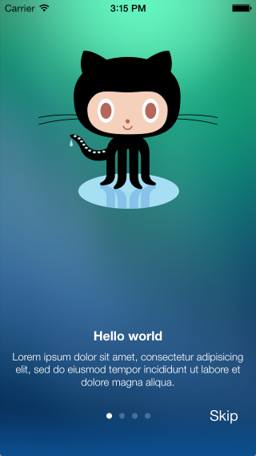

# EAIntroView

 

## Description

🔸 Highly customizable drop-in solution for introduction views.
 🔸 Refactored `Swift Package Manager` version of the [EAIntroView](https://github.com/ealeksandrov/EAIntroView).

## Installation

Use `Swift Package Manager` to install.

## How To Use It

Read the original [README](https://github.com/ealeksandrov/EAIntroView/blob/facd226df913c640c777454e4d08be8dc93292fc/README.md) file.

## Credits

Created and maintained by [ealeksandrov](https://github.com/ealeksandrov). Refactored and adapted for use with the `Swift Package Manager` by [epitonium](https://github.com/epitonium).

## License

`EAIntroView` is distributed under the terms and conditions of the [LICENSE](https://github.com/ealeksandrov/EAIntroView/blob/facd226df913c640c777454e4d08be8dc93292fc/LICENSE.md).